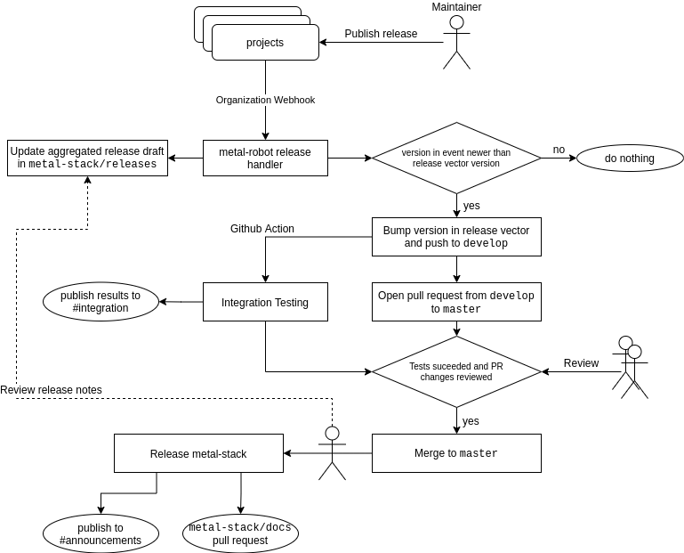
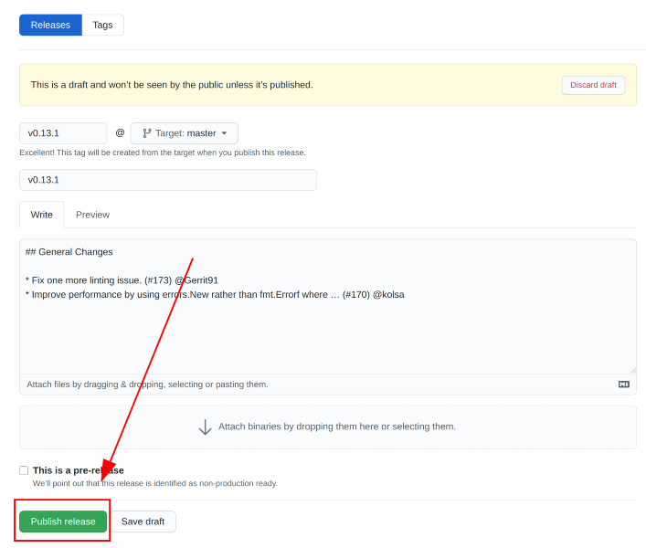

# Releases

The metal-stack contains of many microservices that depend on each other. The automated release flow is there to ensure that all components work together flawlessly for every metal-stack release.

This document is intended for maintainers of metal-stack projects.

## Release Flow

The following diagram attempts to describe our current release flow:



### How-To Release a Project

[release-drafter](https://github.com/release-drafter/release-drafter) is preferred in order to generate release notes from merged PRs for your projects. It should be triggered for pushes on your master branch.

The draft is then used to create a project release. The release has to be published through the Github UI as demonstrated in the screenshot below.

**<span style="color:red">Tagging the repository is not enough as repository tagging does not associate your release notes to your release!</span>**



Some further remarks:

- Use semver versions with `v` prefix for your tags
- Name your release after your release tag
- A tag created through a Github UI release does not trigger a `push` event . This means, your pipeline will not start to run with the `push` trigger when publishing through the UI.

  Instead, use the `published` [release event trigger](https://docs.github.com/en/actions/reference/events-that-trigger-workflows#release) for your actions:

  ```yaml
  on:
   release:
     types:
     - published
  ```
